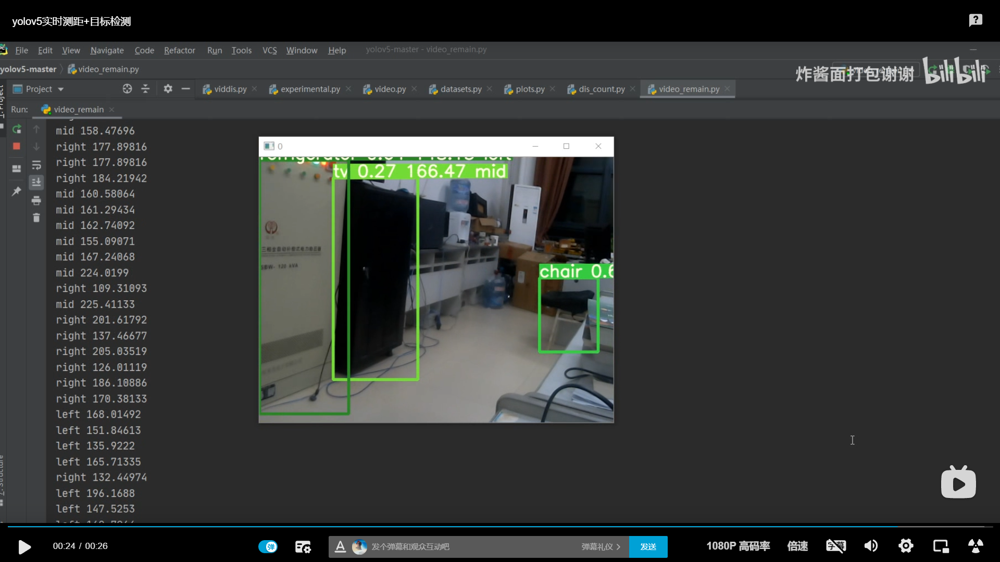
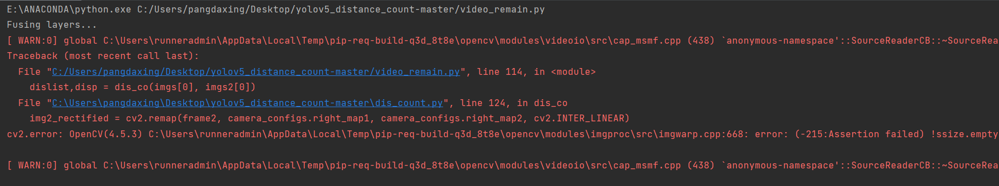
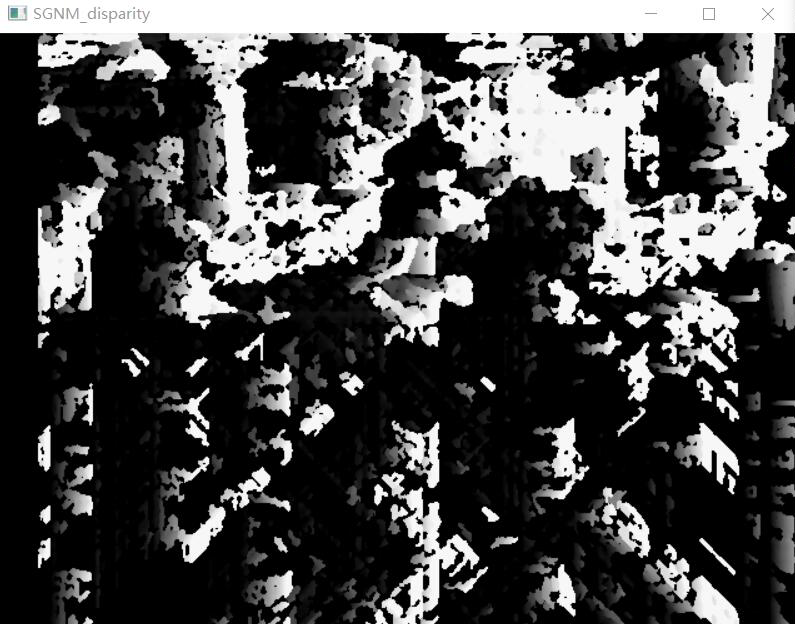

# yolov5-双目摄像头
通过yolov5实现目标检测+双目摄像头实现距离测量 

  

示例视频 ===>[https://www.bilibili.com/video/BV1QK411w71d] 

## yolov5
本项目基于yolov5 ===>[https://github.com/ultralytics/yolov5](https://github.com/ultralytics/yolov5) 
我把v5s那个权重放在里面了 你可以加任意的权重 自己训练的权重也行

## 版本号
版本号选择的是3.1  当然  这个项目和什么版本是无关的 你可以用任意版本（至少到目前是这样子的）

## 如何使用
在原始的 "yolov5" 中添加了3个文件 --->
camera_config.py
dis_count.py
video_remain.py

1.首先要进行你的双目摄像头的标定
具体的标定方法百度上有很多，我推荐matlab标定
额  因为我没找到python标定很好的程序 如果你找到了 也请你告诉我一下plzzzz哈哈
2.确定你的双目摄像头是单设备号还是双设备号的，
双设备号要确定你的设备号各是多少
比如我的摄像头是0和2
我就在video_remain.py 的59/60行
写了（0）（2）
3.如果是单设备号 
百度一下单设备号双目摄像头如何使用

|文件|说明|
|----|----|
|camera_config.py|双目摄像头参数|
|dis_count.py|深度图+距离矩阵|
|video_remain.py|主函数|

## RESULT
|DEVICEE|FPS|
|----|----|
|1650|20|
|TX2|12|
|NX|15|

## 现在见到的问题
### 问题一

  

这个 就是设备号的问题 

### 问题二

  

深度图乱七八糟的 这是因为你的双目摄像头没有标定
参数还用的是我的参数

-------
我在月底会整理一份从标定到每一项很详细的教程 最近在医院检查身体
-------

按理来说啊~接上你的双目摄像头直接运行vedio_remain.py这个文件就能实现了

如果这个项目对你有帮助 请帮我点个星星吧  谢谢啦~

那个如果有啥想联系的 可以直接在github里面留言问我

有什么问题可以在b站视频评论区或者github里面留言，我都会看并且解答的